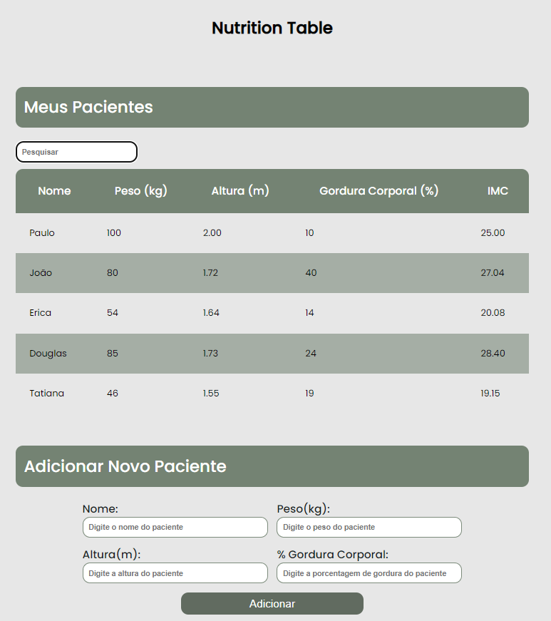

<h1 align="center">📑 Nutrition-Table 🍎</h1>

Software to plan day to day tasks, project.

This project was made following Front End Mentor's design, you can see the challenge by <a href="">clicking here.</a>

- <a href="https://cursos.alura.com.br/course/javascript-programando-na-linguagem-web">Original challenge</a>

<h2>⚙️Tecnologias</h2>

<h2>❔ How to Use </h2>

Before cloning the repository into your machine you'll need <a href="https://git-scm.com/">Git</a>. Also it is good to have a code editor like <a href="https://code.visualstudio.com/">VSCode.</a>

<h2>😈 Author </h2>

Made with ❤️ by Gustavo Barboza

<h3>☎️ Get in touch:</h3> 

   
   

